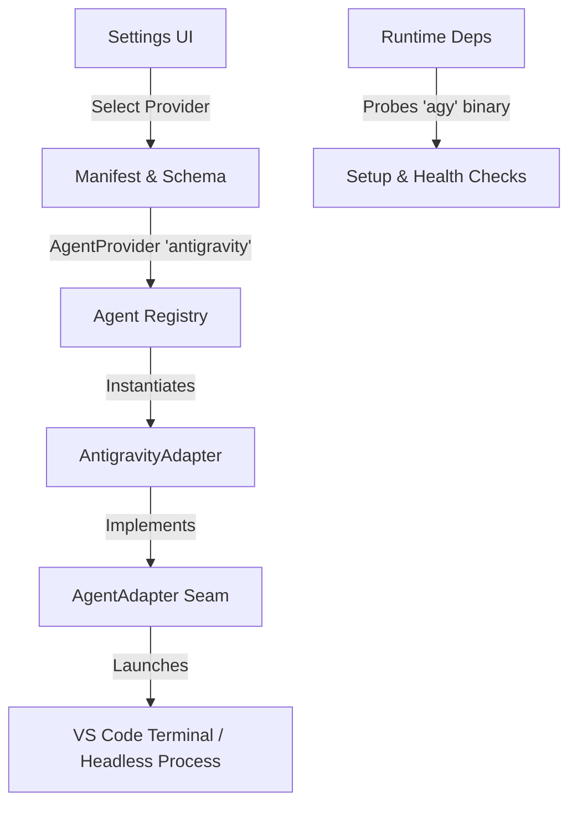

# Karst — Antigravity Agent Core Extension Research & Plan

**Document ID:** `005-antigravity-agent-core-plan`
**Status:** Research & Architecture Plan
**Target Component:** Karst Agent Boundary (`src/agent/`) & Manifest Integration

---

## 1. Overview & Goals

Karst is designed around an **agent-execution adapter seam** ([adapter.ts](file:///Users/nd/Work/projects/karst/src/agent/adapter.ts)), isolating vendor-specific CLI flags, auth, and launch formats behind a clean interface (`AgentAdapter`). Currently, Karst implements [ClaudeAdapter](file:///Users/nd/Work/projects/karst/src/agent/claude.ts) (`claude` CLI) for active session execution, while `codex` remains a placeholder/inert option in settings.

This research document analyzes the project architecture and details the precise modifications needed to integrate **Google Antigravity CLI (`agy`)** as a first-class, switchable agent core.

> [!NOTE]
> **No code implementation is performed in this step.** This document serves as the design specification and step-by-step implementation plan for adding `antigravity` support to Karst.

---

## 2. Antigravity CLI (`agy`) Capabilities & Surface Analysis

Based on analysis of the installed `agy` binary (`/Users/nd/.local/bin/agy`) and documentation:

| Feature / Surface | Claude Code (`claude`) | Antigravity CLI (`agy`) | Integration Strategy |
| :--- | :--- | :--- | :--- |
| **CLI Binary** | `claude` | `agy` | Registered in [deps.ts](file:///Users/nd/Work/projects/karst/src/runtime/deps.ts) as required binary |
| **Interactive Launch** | `claude --model <m> -- <prompt>` | `agy --model <m> -i "<prompt>"` | `buildInteractiveCommand` formats `agy` flags |
| **Headless Mode** | `claude -p "<prompt>" --output-format json` | `agy -p "<prompt>"` | `runHeadless` spawns `agy -p` buffering stdout |
| **Session Resume** | `claude --resume <session_id>` | `agy --conversation <session_id>` | Map `opts.resume` to `--conversation` flag |
| **Permissions** | `claude --permission-mode bypassPermissions` | `agy --dangerously-skip-permissions` | Map `permissionMode` to `--dangerously-skip-permissions` |
| **Models** | `claude-sonnet-5`, `claude-opus-4-8`, etc. | `gemini-3.6-flash`, `gemini-3.6-pro`, `gemini-2.5-pro`, `gemini-2.5-flash` | Provider model choices in [models.ts](file:///Users/nd/Work/projects/karst/src/agent/models.ts) |
| **Plugins / Custom Commands** | `.claude-plugin/plugin.json` + `--plugin-dir` | `agy plugin`, `.gemini/skills/`, `.gemini/rules/` | Materialize commands into `.gemini/skills` or orchestrator prompt |

---

## 3. Core Architecture Seams to Extend

The Karst codebase requires changes across 6 key subsystems:



### 3.1 Subsystem 1: Manifest Schema & Data Model
- **File:** [src/manifest/types.ts](file:///Users/nd/Work/projects/karst/src/manifest/types.ts)
  - Update `AgentProvider` type definition:
    ```typescript
    export type AgentProvider = 'claude' | 'codex' | 'antigravity';
    ```
- **File:** [src/manifest/schema.ts](file:///Users/nd/Work/projects/karst/src/manifest/schema.ts)
  - Update `validateAgentProvider`: Accept `'antigravity'` in addition to `'claude'` and `'codex'`.
- **File:** [src/manifest/write.ts](file:///Users/nd/Work/projects/karst/src/manifest/write.ts)
  - Ensure overlay serializes `agentProvider` correctly when updating `karst.yml`.
- **File:** [karst.example.yml](file:///Users/nd/Work/projects/karst/karst.example.yml)
  - Document `'antigravity'` in example configuration comments.

### 3.2 Subsystem 2: The Agent Adapter (`AntigravityAdapter`)
- **File:** `src/agent/antigravity.ts` *(New File)*
  - Class `AntigravityAdapter` implementing `AgentAdapter` ([adapter.ts](file:///Users/nd/Work/projects/karst/src/agent/adapter.ts)):
    - `readonly requiredBinary = 'agy';`
    - `capabilities: AgentCapabilities = { httpHooks: false, resume: true };`
    - `buildInteractiveCommand(opts: InteractiveCommandOpts)`:
      - Construct command arguments for `agy`:
        - `--model <model>` (if specified)
        - `--conversation <resume>` (if resuming)
        - `--dangerously-skip-permissions` (if bypass requested)
        - `-i <initialPrompt>` (if initial seed prompt present)
        - Append any `extraArgs`
    - `runHeadless(opts: RunHeadlessOpts)`:
      - Spawn `agy -p <prompt>` using injected spawner.
      - Return `HeadlessResult`: `{ sessionId: '', verdict: null, raw: stdout }`.
    - `materializeApproach(opts: MaterializeOpts)`:
      - Convert neutral approach artifacts (`pkg`) into Antigravity skills (`.gemini/skills/`) or inject workflow steps into the seed prompt.

### 3.3 Subsystem 3: Registry & Dependency Management
- **File:** [src/agent/registry.ts](file:///Users/nd/Work/projects/karst/src/agent/registry.ts)
  - Include `'antigravity'` in `IMPLEMENTED_PROVIDERS`:
    ```typescript
    export const IMPLEMENTED_PROVIDERS: readonly AgentProvider[] = ['claude', 'antigravity'];
    ```
  - Map factory:
    ```typescript
    const FACTORIES: Partial<Record<AgentProvider, () => AgentAdapter>> = {
      claude: () => new ClaudeAdapter(),
      antigravity: () => new AntigravityAdapter(),
    };
    ```
- **File:** [src/runtime/deps.ts](file:///Users/nd/Work/projects/karst/src/runtime/deps.ts)
  - Register `antigravity` entry in `AGENT_CLI_DEPENDENCIES`:
    ```typescript
    antigravity: {
      binary: 'agy',
      label: 'the Antigravity CLI (agy)',
      install: 'Install the Antigravity CLI and ensure "agy" is on your PATH.',
    }
    ```
  - Update `agentDependency(provider)` to return the exact `agy` dependency.

### 3.4 Subsystem 4: Models & Provider Selection
- **File:** [src/agent/models.ts](file:///Users/nd/Work/projects/karst/src/agent/models.ts)
  - Define model lists per provider (e.g. Gemini 3.6 Flash, Gemini 3.6 Pro for Antigravity) or allow dynamic model lists per provider.

### 3.5 Subsystem 5: Settings & Onboarding UI
- **File:** [src/ui/settings/state.ts](file:///Users/nd/Work/projects/karst/src/ui/settings/state.ts)
  - Pass `'antigravity'` in `implementedProviders`.
- **File:** [src/ui/settings/webview.html](file:///Users/nd/Work/projects/karst/src/ui/settings/webview.html)
  - Update `KNOWN_AGENT_PROVIDERS` array to include `'antigravity'` alongside `'claude'` and `'codex'`.
  - Update `KNOWN_MODELS` array to include Antigravity model options, mirroring `src/agent/models.ts`.
  - Ensure the `<select id="agentProvider">` correctly renders `'antigravity'` as an enabled option.
- **File:** [src/ui/onboarding/](file:///Users/nd/Work/projects/karst/src/ui/onboarding/)
  - Ensure setup checklist correctly validates `agy` binary presence when `antigravity` is selected as provider.

---

## 4. Implementation Plan & Phases

### Phase 1: Data Model & Schema Infrastructure
1. Add `'antigravity'` to `AgentProvider` in [src/manifest/types.ts](file:///Users/nd/Work/projects/karst/src/manifest/types.ts).
2. Update `validateAgentProvider` in [src/manifest/schema.ts](file:///Users/nd/Work/projects/karst/src/manifest/schema.ts).
3. Unit test: `src/manifest/load.test.ts` verifying `agentProvider: antigravity` parses correctly.

### Phase 2: Antigravity Adapter Implementation
1. Create `src/agent/antigravity.ts` implementing `AgentAdapter`.
2. Implement `buildInteractiveCommand` for `agy`.
3. Implement `runHeadless` for `agy` with stdout parsing.
4. Implement `materializeApproach` for `.gemini/skills/` structure.
5. Unit test: `src/agent/antigravity.test.ts` covering flag generation, headless execution, and approach materialization.

### Phase 3: Registry, Dependencies, & Provider Wiring
1. Update [src/agent/registry.ts](file:///Users/nd/Work/projects/karst/src/agent/registry.ts) to export `antigravity` in `IMPLEMENTED_PROVIDERS`.
2. Update [src/runtime/deps.ts](file:///Users/nd/Work/projects/karst/src/runtime/deps.ts) with `agy` dependency definition.
3. Unit tests: `registry.test.ts` & `deps.test.ts`.

### Phase 4: UI & Model Picker Support
1. Update `KNOWN_AGENT_PROVIDERS` and `KNOWN_MODELS` inside [src/ui/settings/webview.html](file:///Users/nd/Work/projects/karst/src/ui/settings/webview.html) and verify the `antigravity` option enables correctly.
2. Add Antigravity models to `KNOWN_MODELS` in [src/agent/models.ts](file:///Users/nd/Work/projects/karst/src/agent/models.ts).
3. Verify settings save & reload flow.

### Phase 5: Verification & End-to-End Validation
1. `npm run typecheck`
2. `npm test`
3. Launch F5 Extension Host, select `antigravity` in Settings, verify dependency check passes for `agy`, and open a session terminal.

---

## 5. Verification Checklist

- [ ] Schema validation permits `agentProvider: antigravity` in `karst.yml`.
- [ ] Dependency checker verifies `/Users/nd/.local/bin/agy` is on `PATH`.
- [ ] `resolveAdapter('antigravity')` returns `AntigravityAdapter`.
- [ ] Terminal session correctly launches `agy -i "<seed prompt>"`.
- [ ] All existing vitest suites pass (`npm test`).
