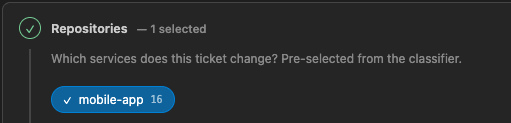

## dependencies check

we have list of dependencies, which are not preinstalled with the extension;
we need to guarantee that user will have all dependencies installed before using the extension.

Need to check all dependencies, and if some are missing, ask user to install them and configure;

For example git, ai provider(which is configurable, but by default Claude Code)

## create ticket

model could be selected if terminal is not opened, once opened it doesn't switch model;

Save button is save & run session button;

effort also as a model should be configurable

rename Repositories with Services

## edit ticket 

shows witer 16 on Repositories 

## dashboard

if no servers run, there no way to spin them up from dashboard

server link should have copy to clipboard button, with visual feedback on copy success

add link from ticket provider if it was fetched from there, with some details of the ticket there;

## states and stages comperhencive visual representation

need to make design system for states and stages, to allign in dashboard, ticket list, and edit ticket page

colors should be matched with stages, so user will understand stage by color

some approaches has several stages in the impl stage;

also servers online and offline representation should be more clear, and align with new states and stages design system

also agent: running has colors; 

Colors for all stages and statuses should have a clear, consistent, and intuitive representation throughout the application. The color palette should be carefully selected to ensure users can easily understand the meaning of each state at a glance, while maintaining consistency across all screens and workflows. Revise all webviews to plan updates; use /frontend-designer to visualize and make variants before approve;

## General

we should have proper error handling. Any error should be caught and user should be notified about it with clear and concise message, what went wrong, and what should user do about it; All errors should be logged in the output channel

